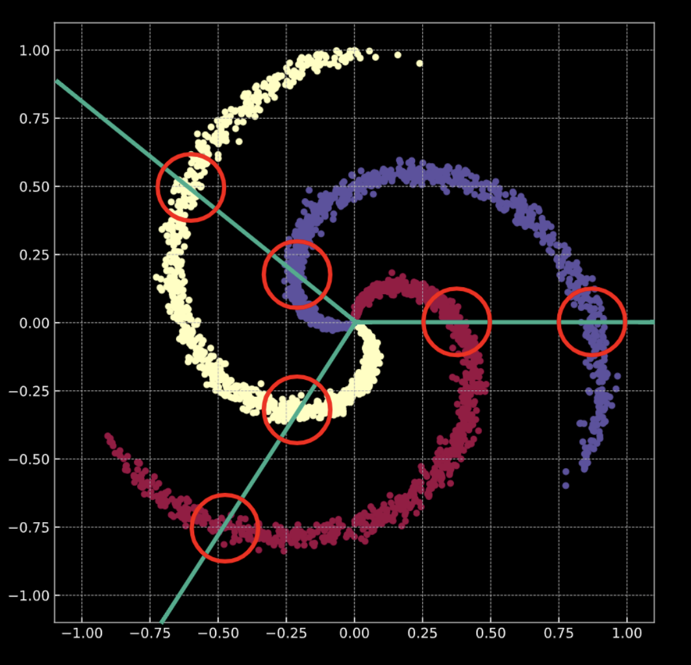
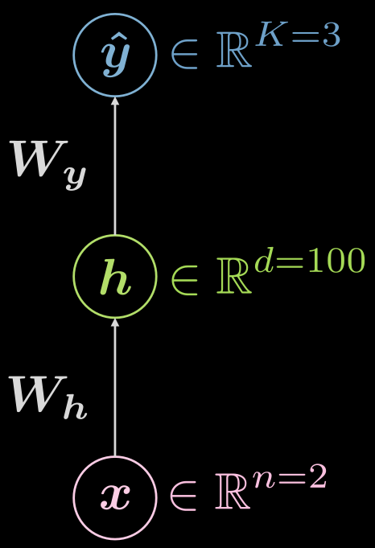
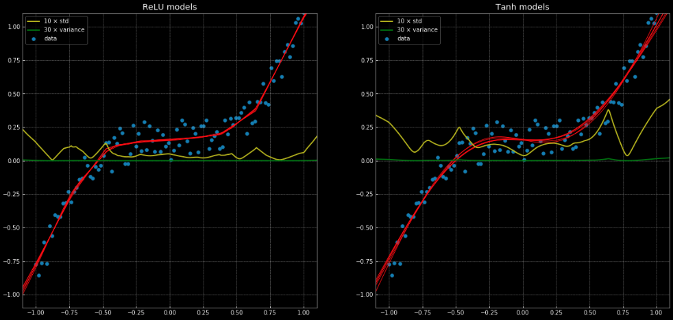

# Deep Learning - Lab 2 (02/04/2020)

#### Artificial neural networks (ANNs): supervised learning for classification (0:02:30)

* Consider **Fig. 1(a)** below. The points in this graph lie on the branches of the spiral, and live in $$\R^2$$. Each color represents a class label. The number of unique classes is $K = 3$. This is represented mathematically by **Eqn. 1(a)**.

* **Fig. 1(b)** shows a similar spiral, with an added Gaussian noise term. This is represented mathematically by **Eqn. 1(b)**.

  In both cases, these points are not linearly separable. 

  ​		   
  ​		   			**Fig. 1(a)** "Clean" 2D spiral	 									**Fig. 1(b)** "Noisy" 2D spiral

  ​        	

  ​										**Eqn. 1(a)**																	**Eqn. 1(b)**

What does it mean to perform **classification**? Consider the case of **logistic regression** (LR). If logistic regression for classification is applied to this data, it will create a set of **linear planes** (decision boundaries) in an attempt to separate the data into its classes. The issue with this solution is that in each region, there are points belonging to multiple classes. The branches of the spiral cross the linear decision boundaries. This is **not** a great solution!

**How do we fix this?** We transform the input space such that the data are forced to be linearly separable. Over the course of training a neural network to do this, the decision boundaries that it learns will try to adapt to the distribution of the training data. 

**Note:** A neural network is always represented from the **bottom up**. The first layer is at the bottom, and the last at the top. This is because conceptually, the input data are low-level features for whatever task the neural network is attempting. As the data traverse **upward** through the network, each subsequent layer extracts features at a higher level.

#### Training data (0:07:50)

Last week, we saw that a newly initialized neural network transforms its input in an arbitrary way. This transformation, however, isn't **(initially)** instrumental in performing the task at hand. We explore how, using data, we can force this transformation to have some meaning that is relevant to the task at hand. The following are data used as training input for a network.

* $$\mathbf X$$ represents the input data, a matrix of dimensions $$\mathbf m$$ (number of training data points) x $$\mathbf n$$ (dimensionality of each input point). In case of the data shown in Figures **1(a)** and **1(b)**, $$\mathbf n = 2$$.

​																				**Fig. 2** Training data

* $$\mathbf c$$  and $$\mathbf Y$$ are both vectors that represent class labels for each of the $$\mathbf m$$ data points. In the example above, there are $$3$$ distinct classes. 

  * $$c_i \in \{1, 2, ..., K\}$$, and $$\mathbf c \in \R^{m*1}$$. **However, it is not true that** $$\mathbf Y \in \R^{m *1}$$, i.e. we do not use $$\mathbf c$$ as training data. If we use distinct numeric class labels $$\mathbf c_i \in \{1, 2, ..., K\}$$, the network may infer an order within the classes that isn't representative of the data distribution. 
  * To bypass this issue, we use **one-hot encoding**. For each data point, a vector of dimension $$K$$ is created, with the $$i$$-th element of the $$\mathbf Y$$ vector set to $$\mathbf 1$$, where $$i \in \{1, 2, ..., K\}$$​ is the class label for that data point (see **Fig. 3** below).

  

  ​																	 **Fig. 3** One-hot encoding
  
  * Therefore, $$\mathbf Y \in \R^{m*K}$$. This matrix can also be thought of as having some probabilistic mass, which is fully concentrated on one of $$K$$ spots.

#### Fully (FC) connected layers (13:43) 

We will now take a look at what a fully connected (FC) network is, and how it works.

 													         **Fig. 4**  Fully connected neural network

Consider the network shown above in **Fig. 4**. The input data, $$x$$, is subject to an affine transformation defined by $$W_h$$, followed by a non-linear transformation. The result of this non-linear transformation is denoted as $$h$$, representing a **hidden** output, i.e. one that is not **seen** from outside the network. This is followed by another affine transformation ($$W_y$$), followed by another non-linear transformation. This produces the final output, $$\hat{y}$$. This network can be represented mathematically by the equations in **Fig. 5** below. $$f$$ and $$g$$ are both non-linearities.

​																	**Fig. 5** Math behind a FC network

**A basic neural network such as the one shown above is merely a set of successive pairs, with each pair being an affine transformation followed by a non-linear operation (squashing).** Frequently used non-linear functions include ReLU, sigmoid, hyperbolic tangent, and softmax.

The network shown above is a 3-layer network: 

​			$$1$$ - input neuron

​			$$2$$ - hidden neuron

​			$$3$$ - output neuron

Therefore, a $$3$$-layer neural network has $$2$$ affine transformations. This can be extrapolated to a $$n$$-layer network.

Now let's move to a more complicated case.

Let's do a case of 3 hidden layers, fully connected in each layer. An illustration can be found in **Fig. 6**

​																	**Fig. 6** Neural net with 3 hidden layers

Let's consider a neuron $j$ in the second layer. It's activation is:

$ a^{(2)}_j = f(w^{(j)} x + b_j) = f\big( (\sum_{i=1}^n w_i^{(j)} x_i) +b_j ) \big)  $

where $w^{(j)}$ is the jth row of $W^{(1)}$. 

Notice that the activation of the input layer in this case is just the identity. The hidden layers can have activations like ReLU, hyperbolic tangent, sigmoid, soft (arg)max, etc.

The activation of the last layer in general would depend on your use case, as explained in [this](https://piazza.com/class/k5spqaanqk51ks?cid=36) Piazza post.

#### Neural Network (Inference) (0:23:21)

Let's think about the two-layer neural network again, as seen in **Fig. 7**

​																	**Fig. 7** Two-layer neural network.

What kind of functions are we looking at?

$\hat{y} = \hat{y}(x) , \quad \hat{y}: \mathbb{R}^n \rightarrow \mathbb{R}^C, \quad x \mapsto \hat{y} $

However, it is helpful to visualize the fact that there is a hidden layer, and the mapping can be expanded as:

$\hat{y}: \mathbb{R}^{n} \rightarrow \mathbb{R}^d \rightarrow \mathbb{R}^C, \quad d \gg n, C $

What might an example configuration for the case above look? In this case, one has input of dimension two ($n=2$), the single hidden layer could have dimensionality of 1000 ($d = 1000$), and we have 3 classes ($C=3$). There are good practical reasons to not have so many neurons in one hidden layer, so it could make sense to split that single hidden layer into 3 with 10 neurons each ($1000 \rightarrow 10 \otimes 10 \otimes 10$).

#### Neural Network (Training I) (0:27:28)

So what does typical training look like? It is helpful to formulate this into the the standard terminology of losses. 

First, let us re-introduce the soft (arg)max and explicitly state that it is a common activation function for the last layer, when using negative log-likelihood loss, in cases for multi-class prediction. As stated by Professor LeCun in lecture, this is because you get nicer gradients than if you were to use sigmoids and square loss. In addition, your last layer will already be normalized (the sum of all the neurons in the last layer come out to 1), in a way that is nicer for gradient methods than explicit normalization (dividing by the norm).

The soft (arg)max will give you logits in the last layer that look like this:

$\text{soft(arg)max(l)[c]} = \frac{ \text{exp}(l[c])}   {\sum^C_{j=1} \text{exp}(l[j])}  \in (0, 1)     $

It is important to note that the set is not closed because of the strictly positive nature of the exponential function. 

Given the set of the predictions $\hat{Y}$, the loss will be:

$\mathcal{L}(\hat{Y}, c) = \frac{1}{m} \sum_{i=1}^m \ell(\hat{y}_i, c_i), \quad \ell(\hat{y}, c) = -\log(\hat{y}[c])  $

Here c denotes an the integer label, not the one hot encoding representation.

So let's do two examples, one where an example is correctly classified, and one where it is not. 

Let's say $x, \quad c = 1 \Rightarrow y = \begin{bmatrix}
           1 \\
           1 \\
           0
         \end{bmatrix}$

What is the instance wise loss?

For the case of *nearly perfect prediction*:

$ \hat{y}(x) = \begin{bmatrix} \sim 1 \\ \sim 0 \\ \sim 0 \end{bmatrix} \Rightarrow \ell (\begin{bmatrix} \sim 1 \\ \sim 0 \\ \sim 0 \end{bmatrix}, 1) \rightarrow 0^{+}  $

For the case of *nearly absolutely wrong*:

$ \hat{y}(x) = \begin{bmatrix} \sim 0 \\ \sim 1 \\ \sim 0 \end{bmatrix} \Rightarrow \ell (\begin{bmatrix} \sim 0 \\ \sim 1 \\ \sim 0 \end{bmatrix}, 1) \rightarrow +\infty  $

Note in the above examples, $\sim 0 \rightarrow 0^{+}$ and $\sim 1 \rightarrow 1^{-}$

**Note**: It is important to know that if you use `CrossEntropyLoss`, you will get `LogSoftMax` and negative loglikelihood `NLLLoss` bundled together, so don't do it twice!

#### Neural Network (Training II) (0:36:30)

For training, we aggregate all trainable parameters -- weight matrices and biases -- into a collection we call $\Theta = \{W_h, b_h, W_y, b_y\}$. This allows us to write the objective function or loss as:

$$ J \left( \Theta \right) = \mathcal{L} \left( \hat{Y} \left( \Theta \right), c \right) \in \mathbb{R}^{+}$$

This makes the loss depend on the output of the network  $\hat{Y} \left( \Theta \right)$, so we can turn this into an optimization problem.

As simple illustration of how this works can be seen in **Fig. 8**, where $J(\mathcal{v})$ is the function we need to minimize.

 
    <b>Fig. 8</b> Optimizing a loss function through gradient descent.

We pick a random initialization point $\mathcal{v}_0$ -- with associated loss $J(\mathcal{v}_0)$. We can compute the derivative evaluated in that point $J'(\mathcal{v}_0) = \frac{\partial J(\mathcal{v})}{\partial \mathcal{v}} \left( \mathcal{v}_0 \right)$. In this case, the slope of the derivative is positive. So we need to take a step in the direction of steepest descent. In this case, that is $-\frac{\partial J(\mathcal{v})}{\partial \mathcal{v}}$.

The iterative repetition of this process is known as gradient descent. Gradient methods are the primary tool to train a neural network.

In order to compute the necessary gradients, we have to use back-propagation

$$ \frac{\partial \, J(\mathcal{\Theta})}{\partial \, \mathcal{W_y}} = \frac{\partial \, J(\mathcal{\Theta})}{\partial \, \hat{y}} \; \frac{\partial \, \hat{y}}{\partial \, \mathcal{W_y}} \quad \quad \quad  \frac{\partial \, J(\mathcal{\Theta})}{\partial \, \mathcal{W_h}} = \frac{\partial \, J(\mathcal{\Theta})}{\partial \, \hat{y}} \; \frac{\partial \, \hat{y}}{\partial \, h} \;\frac{\partial \, h}{\partial \, \mathcal{W_y}} $$

#### Spiral Classification - Jupyter notebook (42:00)

The Jupyter notebook can be found [here](https://github.com/Atcold/pytorch-Deep-Learning-Minicourse/blob/master/04-spiral_classification.ipynb). In order to run the notebook, make sure you have `the dl-minicourse` environment installed as specified in [README.md](https://github.com/Atcold/pytorch-Deep-Learning-Minicourse/blob/master/README.md).

An explanation of how to use `torch.device()` can be found in [last week's notes](https://atcold.github.io/pytorch-Deep-Learning-Minicourse/chapters/01-3/).

Like before, we are going to be working with points in $\mathbb{R}^2$ with three different categorical labels - in red, yellow and blue - as can be seen in **Fig. 9**.

 
<b>Fig. 9</b> Spiral classification data.

`nn.Sequential()` is a container, which passes modules to the constructor in the order that they are added; `nn.linear()` is miss-named as it applies an **affine** transformation to the incoming data: $y = Wx + b$. For more information, refer to the [PyTorch documentation](https://pytorch.org/docs/stable/nn.html).

Remember, an affine transformation is five things: rotation, reflection, translation, scaling and shearing.

As it can be seen in **Fig. 10**, when trying to separate the spiral data with linear decision boundaries - only using `nn.linear()` modules, without a non-linear between them - the best we can achieve is an accuracy of 50%.

 
<b>Fig. 10</b> Linear decision boundaries.

When we go from a linear model to one with two `nn.linear()` modules and a `nn.ReLU()` between them, the accuracy goes up to 95%. This is because the boundaries become non-linear and adapt much better to the spiral form of the data, as it can be seen in **Fig. 11**.

 
    <b>Fig. 11</b> Non-linear decision boundaries.

An example of a regression problem which can't be solved correctly with a linear regression, but is easily solved with the same neural network structure can be seen in [this notebook](https://github.com/Atcold/pytorch-Deep-Learning-Minicourse/blob/master/05-regression.ipynb) and **Fig. 12**, which shows 10 different networks, where 5 have a a `nn.ReLU()` link function and 5 have a `nn.Tanh()`. The former is a piecewise linear function, where the latter is a continuous and smooth regression.

 
<b>Fig. 12</b>: 10 Neural networks, along with their variance/SD. 
Left: 5 ReLu networks.  Right: Five TanH networks.

The yellow and green lines show the standard deviation and variance for the networks. Using these is useful for something similar to a "confidence interval" - since the functions give a single prediction per output. Using ensemble variance prediction allows us to estimate the uncertainty with which the prediction is being made. The importance of this can be seen in **Fig. 13**, where we extend the decision functions outside the training interval and these tend towards $+\infty, -\infty$.

 
<b>Fig. 6</b> Neural networks, with variance/SD, outside training interval. 
Left: 5 ReLu networks.  Right: Five TanH networks.

